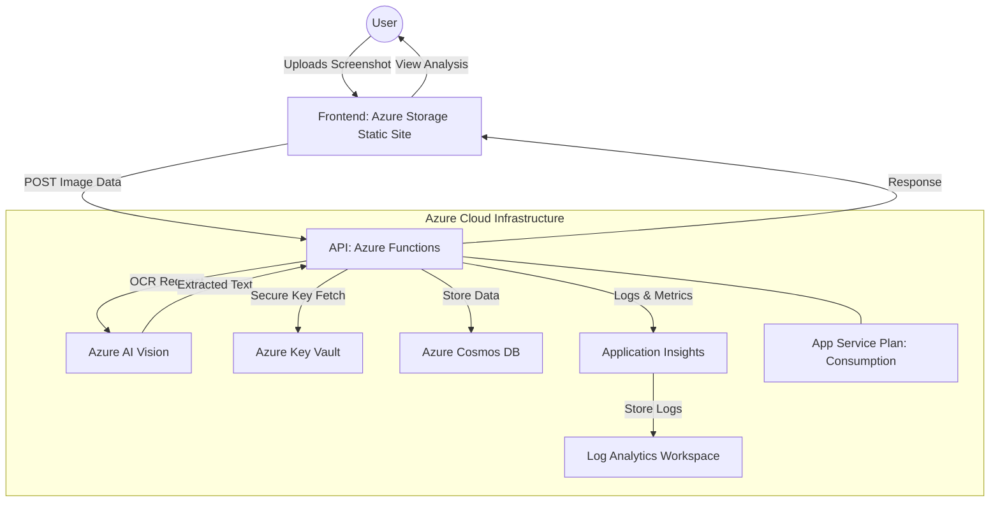

# Project Report: AI-Powered Investment Portfolio Analyzer

## 1. Project Overview
The **AI-Powered Investment Portfolio Analyzer** is a 100% cloud-native, serverless application designed to digitize and analyze investment portfolio screenshots. Using state-of-the-art Azure AI services, it transforms unstructured images into actionable financial intelligence, including valuation metrics and investment suggestions.

## 2. System Architecture
The system follows a modern microservices-inspired serverless architecture, ensuring high availability, scalability, and cost-efficiency.

---

## 2. Core Features

### 🟢 AI-Driven OCR (Optical Character Recognition)
*   **Feature**: Automated text extraction from images.
*   **Usage**: Uses **Azure AI Vision (Read API)** to identify stock tickers, share quantities, and current prices directly from a screenshot. It eliminates the need for manual data entry.

### 📊 Automated Financial Metrics
*   **Feature**: Real-time valuation analysis.
*   **Usage**: Once stocks are identified, the system calculates the **P/E (Price-to-Earnings) Ratio** and **P/B (Price-to-Book) Ratio** for each holding. This provides immediate context on whether a stock is expensive or cheap relative to its earnings/book value.

### 💡 Intelligent Investment Suggestions
*   **Feature**: Rule-based AI advisory.
*   **Usage**: Based on the P/E ratios, the system provides one of three tailored suggestions:
    *   **Strong Buy/Healthy Buy**: For undervalued stocks (Low P/E).
    *   **Hold**: For fairly valued stocks (Medium P/E).
    *   **Avoid**: For overvalued stocks (High P/E).

### ☁️ 100% Cloud-Native Dashboard
*   **Feature**: High-end serverless web interface.
*   **Usage**: Rebuilt as a glassmorphism-themed dashboard using Vanilla JS/CSS and hosted on **Azure Storage Static Websites**. It allows users to upload images and view history from any browser globally.

---

## 3. Technology Stack (Azure Cloud)

| Service | Role in Project | Detailed Explanation |
| :--- | :--- | :--- |
| **Azure AI Vision** | The "Brain" | Performs high-precision OCR to read screenshots. Identifies symbols, quantities, and prices. |
| **Azure Functions** | The "Engine" | Serverless Python backend that processes data, runs financial logic, and integrates with the database. |
| **Azure Cosmos DB** | The "Memory" | NoSQL database storing every analysis record permanently with global scale. |
| **Azure Storage** | The "Host" | Stores raw images in blob containers and hosts the static website dashboard. |
| **Azure Key Vault** | The "Vault" | Securely manages API keys and connection strings, ensuring infrastructure security. |
| **Application Insights** | The "Monitor" | Full-stack observability tracking performance, failures, and execution telemetry. |
| **Log Analytics** | The "Analyst" | Aggregates logs from all cloud services for centralized auditing and debugging. |
| **App Service Plan** | The "Compute" | Consumption-based plan that provides dynamic scaling and zero-idle-cost execution. |

---

## 4. System Workflow (Step-by-Step)

1.  **Input**: User uploads a screenshot via the Cloud Dashboard.
2.  **Transmission**: The image is sent securely via a `POST` request to an **Azure Function API**.
3.  **OCR Processing**: The Function calls **Azure AI Vision** to extract raw text content.
4.  **Analysis**:
    *   Regex logic filters for stock symbols (e.g., AAPL, NVDA).
    *   Quantity and Price are extracted.
    *   The **Financial Engine** applies P/E and P/B ratios.
5.  **Storage**: The final structured JSON is saved into **Cosmos DB**.
6.  **Display**: The Dashboard refreshes to show the new analysis cards with color-coded suggestions.

---

## 5. Summary of Innovation
This project demonstrates a complete **Serverless Pipeline**. It solves the problem of "manual portfolio tracking" by using AI to bridge the gap between an image and a database. By hosting everything on Azure, it ensures massive scalability and zero maintenance for the end user.
